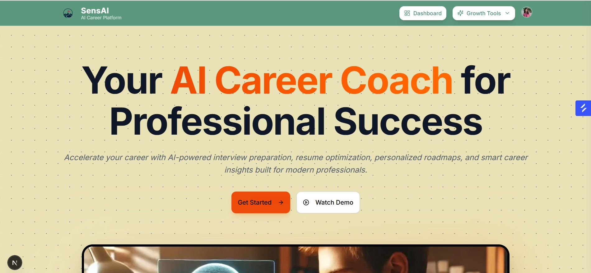

# CareerMind

CareerMind is an AI-powered career coaching platform built with Next.js.  
It helps users create professional resumes, generate personalized cover letters, prepare for interviews, and explore career insights using AI-driven tools.

---

## Features

### 1. AI Resume Maker
Create ATS-friendly resumes instantly with AI-powered formatting, content suggestions, and professional templates.

### 2. AI Cover Letter
Generate personalized cover letters tailored to your skills, experience, and target job roles in seconds.

### 3. AI Quiz & Interview Prep
Practice smart quizzes and interview questions with instant AI feedback to improve confidence and performance.

### 4. Career Insights
Explore salary trends, in-demand skills, industry growth, and personalized career recommendations powered by AI.
